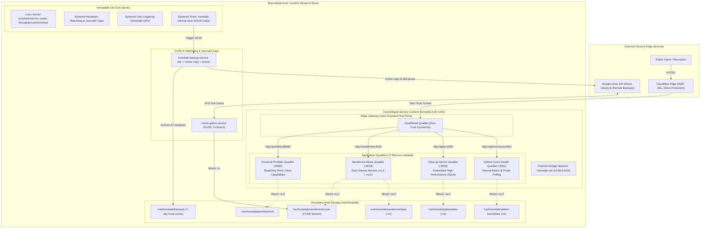

# Declarativev Immutable Homelab & GitOps Platform (v2)


A declarative, production-grade private cloud platform engineered on bare-metal immutable **CentOS Stream 9 Bootc**. Built under the **KISS (Keep It Simple, Stupid)** philosophy, eliminating nested hypervisor overhead by running workloads as native, rootless **Podman Quadlets** under strict **SELinux Enforcing** mode. Orchestrated entirely via **Ansible Navigator** following Red Hat Enterprise (RHCSA / RHCE) standards.


---


## System Architecture




---


## Core Engineering Competencies Demonstrated

### Enterprise Linux & RHCSA Competencies

* Immutable Operating System (`bootc`): Bootable OCi container image (`quay.io/centos-booc/centos-bootc:stream9`) managing OS deployment, rollback, and automated transactional upgrades via `bootc-fetch-apply-updates.timer`.

* Strict SELinux Enforcement: System runs in enforcing mode. All persistent directories and bind mounts strictly apply `container_file_t` contexts with `:Z` private volume relabeling.

* Systemd User Lingering: Configures rootless systemd execution via `loginctl enable-linger homelab`. Workloads launch as systemd services at boot without active user logins.

* Automated Maintenance Timers: Configures native systemd calendar timers (`homelab-backup.timer`) executing daily backups at 03:00 with auto-pruning.

* FUSE3 Integration: Enables `user_allow_other` in `/etc/fuse.conf` and mounts cloud file systems with VFS caching.


### Modern Configuration Management & RHCE Standards

* Principle of Least Privilege: Global `become = False` in `ansible.cfg`. Privilege escalation (`sudo`) is scoped strictly to tasks requiring administrative privileges.

* Red Hat Ansible Navigator: Fully configured for containerized execution environments (AAP 2.x Standard) using `ansible-navigator.yml`, with log output isolated to /tmp to maintain a clean git workspace.

* Native AES-256 Ansible Vault: Secrets (Cloudflare tokens, Google Drive OAuth tokens, passwords) are encrypted natively via Ansible Vault (`--vault-id`), accompanied by a sanitized `vault.example.yml` schema template.

* SSH Optimization: Pipelining and `ControlMaster` socket multiplexing enabled for ultra-fast task execution.


### Daemonless Containerization (Podman Quadlet)

* Native Systemd Integration: Eliminates Docker Compose in favor of native systemd Quadlet generators (`.container`, `.network`) in `~homelab/config/containers/systemd/`.

* Security Sandboxing: Workload containers drop Linux capabilities (`DropCapability=ALL`) and enforce immutable root filesystems (`ReadOnly=true`).

* Automated Registry Updates: Quadlets specificy `AutoUpdate=registry` for automated container image patching via `podman-auto-update.timer`.


### Zero-Trust Ingress & Git Hygiene

* Zero Exposed Inbound Ports: Public traffic reaches workloads exclusively through encrypted Cloudflare Zero-Trust Tunnels, bypassing CGNAT and eliminating firewall attack surfaces.

* Pre-Commit Filter Pipeline: Enforces trailing-whitespace stripping, POSIX EOF normalization, YAML validation, Gitleaks secret leak detection, and native `ansible-lint` compliance before any commit is accepted.


---


## Operational Runbook

### Environment Initialization

Launch the included DevContainer in VS Code (powered by Fedora 41 and Nushell), or initialize your local environment:

```bash
# Verify available commands
just --list

# Install git pre-commit hooks
just init
```


### Secret Configuration (Ansible Vault)

Create your local vault password file and configure platform secrets:

```bash
# Set your locla vault decryption password (ignored by git)
echo "your-strong-vault-password" > .vault_pass

# Copy the secrets template
cp ansible/inventory/group_vars/all/vault.example.yml \
    ansible/inventory/group_vars/all/vault.yml

# Fill in your real Cloudflare token, Google Drivev OAuth tokens, and passwords

# Encrypt your secrets using AES-256
just vault-encrypt ansible/inventory/group_vars/all/vault.yml
```


### Syntax Verification & Quality Check

Run the automated test suite:

```bash
# Verify playbook syntax
just ansible-check

# Run full pre-commit security and linting suite
just lint
```


### Platform Convergence (Ansible Navigator)

```bash
# Converge platform via standard stdout
just ansible-apply

# Or launch the interactive Red Hat Navigator TUI
just ansible-tui
```


---


## Service Endpoints

| Service            | Endpoint                  | Technology                   | Storage & Security Profile                            |
| ------------------ | ------------------------- | ---------------------------- | ----------------------------------------------------- |
| Personal Portfolio | https://shooey.xyz        | Nginx Alpine Quadlet         | Read-Only Root, Drop ALL Capabilities                 |
| Navidrome Music    | https://music.shooey.xyz  | Navidrome Quadlet            | Google Drive FUSE Mount (`:ro,Z`), Dual Volume Mounts |
| Gitea Git Server   | https://git.shooey.xyz    | Gitea Rootless Quadlet       | High-Performance SQLite, Non-Root UID                 |
| Uptime Dashboard   | https://status.shooey.xyz | Uptime Kuma Quadlet          | Inernal Health Check Polling                          |
| Server Backup      | gdrive:homelab-backups    | Systemd Timer + Rclone       | 03:00 Daily Schedule, 30-Day Retention Pruning        |
| Edge Gateway       | Zero open host ports      | Cloudflare Zero-Trust Tunnel | End-to-End Encrypted Tunnel                           |
